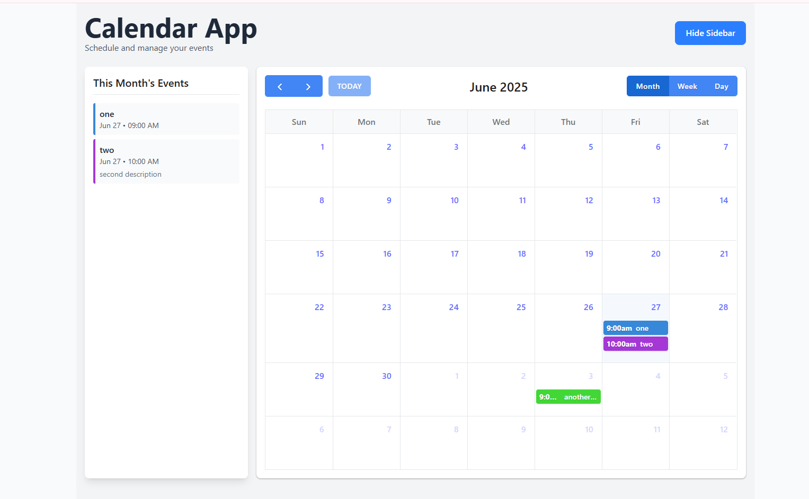

# Calendar App



A modern and responsive calendar application built with the MERN stack (MongoDB, Express, React, Node.js) and FullCalendar.io.

## Features

- Interactive calendar interface using FullCalendar.io
- Create, read, update, and delete events
- Modern UI with Tailwind CSS
- Responsive design for mobile and desktop
- MongoDB database for event storage

## Prerequisites

- Node.js and npm
- MongoDB running locally or a MongoDB Atlas account

## Project Structure

```
fullcalender-io/
├── backend/         # Express server and MongoDB connection
├── frontend/        # React application with FullCalendar
└── start.js         # Script to start both servers
```

## Setup Instructions

### Backend Setup

1. Navigate to the backend directory:
   ```
   cd backend
   ```

2. Install dependencies:
   ```
   npm install
   ```

3. Create a `.env` file with your MongoDB connection string:
   ```
   PORT=5000
   MONGO_URI=mongodb://localhost:27017/calendar-app
   ```

### Frontend Setup

1. Navigate to the frontend directory:
   ```
   cd frontend
   ```

2. Install dependencies:
   ```
   npm install
   ```

## Running the Application

### Option 1: Start both servers with a single command

From the root directory:
```
node start.js
```

### Option 2: Start servers separately

1. Start the backend server:
   ```
   cd backend
   npm start
   ```

2. In a new terminal, start the frontend server:
   ```
   cd frontend
   npm run dev
   ```

3. Open your browser and navigate to the URL shown in the frontend terminal (typically http://localhost:5173)

## Usage

- Click on a date to create a new event
- Click on an existing event to edit or delete it
- Drag and drop events to reschedule them
- Resize events to change their duration

## Technologies Used

- MongoDB
- Express.js
- React.js
- Node.js
- FullCalendar.io
- Tailwind CSS
